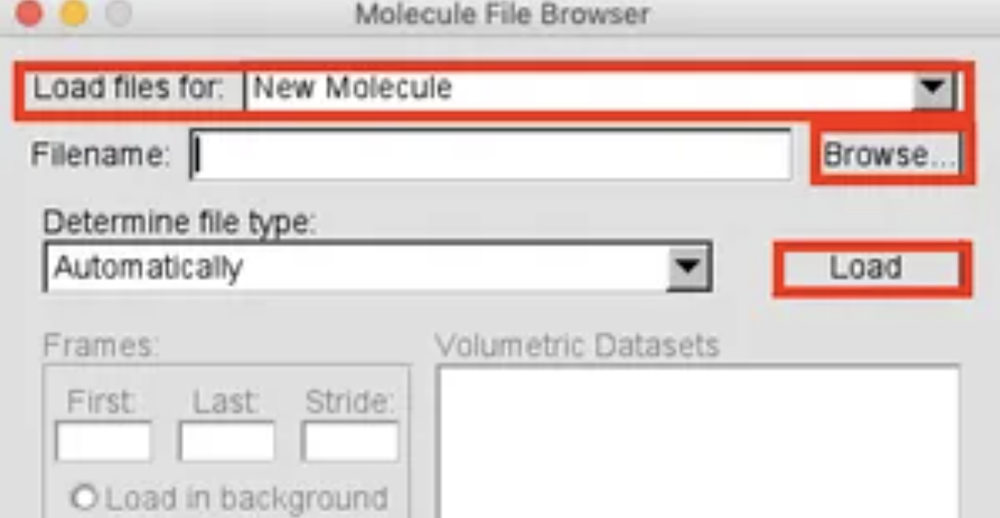

# molecular_dynamics
Visualization of molecular dynamics with VMD

## 分子动力学模拟


VMD 是一款功能强大的免费软件，相较于其他免费软件，如 PyMol，VMD 在处理模拟轨迹等方面更加轻便快捷。想要快速上手？在这里将为你揭秘 VMD 的实用技巧，即使是小白也能轻松掌握！

官方网站: *https://www.ks.uiuc.edu/Development/Download/download.cgi?PackageName=VMD*


**你将解锁以下技能：**

- Mac 环境下 VMD 的安装步骤
- GUI 和 CUI 两种启动方式的详细介绍
- 文件导入的两种方法：图形界面和命令行
- 图形操作技巧：样式、颜色和选择的个性化设置
- 进阶技巧：添加 Repository，实现多重显示效果

## VMD 简介

**Q: 什么是 VMD？**

A: VMD (Visual Molecular Dynamics) 是一款用于分子结构和模拟可视化的软件。它是免费的，与 PyMol 等其他免费可视化软件相比，VMD 在处理模拟轨迹等方面更加轻便快捷。

**Q: VMD 的主要功能和应用领域是什么？**

A: VMD 的主要功能是将分子结构和模拟过程可视化，方便研究人员观察和分析分子的运动和相互作用。它被广泛应用于生物化学、材料科学等领域。

**Q: VMD 与 PyMol 相比有什么不同？**

A: VMD 和 PyMol 都是常用的分子可视化软件，但它们各有特点。PyMol 的图形用户界面 (GUI) 功能更加丰富，而 VMD 在处理模拟轨迹等方面更加轻便高效。

**Q: 为什么 VMD 适合用于生物医学研究？**

A: VMD 非常适合生物医学研究，主要因为它具有以下优势：

1. 轻便性：操作快捷，不占用过多系统资源
2. 对模拟轨迹的良好支持：可以方便地观察和分析分子动力学模拟结果
3. 功能强大：可以分析分子的运动、构象变化以及相互作用等多方面信息
4. 免费开源：降低了研究成本，方便学术交流

## 环境配置

- 操作系统要求：macOS Mojave 10.14.5
- VMD 版本：vmd 1.9.3

macOS Catalina 不支持 VMD 是因为该系统只支持 64 位应用程序。

## VMD 安装步骤

1. 从**官方网站**[1]下载 VMD 安装包，下载时需要注册账号。
2. 下载完成后，将安装包移动至应用程序文件夹。


3. 安装完成。

## VMD 启动方式

VMD 的启动方式有两种：点击应用程序图标启动 (GUI) 和使用终端启动 (CUI)。如果您对 Linux 命令比较熟悉，建议使用后者。

- 图形界面 (GUI) 启动

- 命令行界面 (CUI) 启动

- - 配置环境变量

    将以下内容添加到`~/.bash_profile`或`~/.bashrc`文件中：

    ```
    export PATH="/Applications/VMD 1.9.3.app/Contents/vmd/:$PATH"
    alias vmd='vmd_MACOSXX86'
    ```

  - 使用终端启动 VMD

    重启 shell：

    ```
    $ exec "$SHELL" -l
    ```

    移动到 pdb 文件所在目录，启动 VMD 并读取 `file.pdb` 文件：

    ```
    $ vmd file.pdb
    ```

    同时读取轨迹文件 `file.dcd`：

    ```
    $ vmd file.pdb file.dcd
    ```

## 文件读取

VMD 可以读取分子结构文件（例如 .pdb 文件）和轨迹文件（例如 .dcd 文件）。

#### 读取分子结构文件（例如 .pdb 文件）

- **GUI 操作步骤**

- 1. 启动 VMD 应用，点击 `File` ==> `New Molecule ...`。

     

  2. 确认 `Load files for` 为 `New Molecule`。

     

     

  3. 点击 `Browse...` 选择要显示的文件。

  4. 点击 `Load`。

     

     

  5. 如果要进一步读取轨迹文件，在 `Load files for` 中指定已经读取的文件名，同样点击 `Browse...` 选择文件后点击 `Load`。读取轨迹文件可能需要一些时间。

     **CUI 操作步骤**

     ```
     export PATH="/Applications/VMD 1.9.3.app/Contents/vmd/:$PATH"
     alias vmd='vmd_MACOSXX86'
     $ exec "$SHELL" -l
     $ vmd file.pdb
     $ vmd file.pdb file.dcd
     ```

     1. 同时读取轨迹文件 `file.dcd`：

     1. 移动到要显示的文件所在的目录。
     2. 启动 VMD 并读取 `file.pdb` 文件：

     1. 重启 shell：

     1. 设置路径。在 `~/.bash_profile` 或 `~/.bashrc` 中添加以下内容：

- #### 读取轨迹文件（例如 .dcd 文件）

- 读取轨迹文件的方法请参考上面读取分子结构文件的方法，在读取分子结构文件之后，按照步骤 5 进行操作即可。

- ## 图形操作

- 在 VMD 主窗口中，点击 `Graphics` ==> `Representations...` 即可打开图形操作窗口：

- 

- 打开后的图形操作窗口如下所示：

- 


该窗口是进行图形操作的主要窗口。初始默认设置下，`Style` 为 `Lines`，`Color` 为 `Name`，`Selection` 为 `all`。通过修改以下选项可以改变图形的显示方式：

- Style : `Drawing Method`
- Color : `Coloring Method`
- Selection : `Selected Atoms`

#### Style 设置

`Drawing Method` 用于设置绘图方式。

- **Lines:** 以线形显示分子结构。

- **New Cartoon:** 以卡通形式显示蛋白质结构，推荐使用。

  

  

- **Bonds:** 以键的形式显示分子结构，推荐用于配体显示。

  

  

- **其他常用 Style:** VMD 提供了丰富的 Style 选项，用户可以根据需求选择。


#### Color 设置

`Coloring Method` 用于设置着色方式。

- **Name:** 根据原子名称着色，默认设置，显示效果良好。
- **ColorID:** 使用指定的颜色 ID 进行着色。
- **其他常用 Color:** VMD 提供了多种着色方案，例如根据残基类型、二级结构等。

#### Selection 设置

`Selected Atoms` 栏可以输入命令来选择要显示的原子，从而改变显示的内容。

- **语法规则：** VMD 使用特定的语法规则选择原子，需要用户学习和熟悉。

- **常用命令示例：**

- - 显示蛋白质主链：`protein and noh`
  - 显示特定残基：`resname ARG` (以精氨酸为例)
  - 显示特定原子：`name N CA` (以氮原子和 α-碳原子为例)
  - 显示特定区域内的原子：`amino within 5 of resname G39` (显示距离残基 G39 5 埃范围内的氨基酸残基)

#### Repository 的使用

- **创建新的 Repository:** 点击 `Create Rep` 按钮可以创建一个新的 Repository，用于同时比较不同的显示方式。
- **设置不同 Repository 的显示样式：** 每个 Repository 可以设置不同的 Style、Color 和 Selection，从而实现不同的显示效果。
- **Repository 的应用实例：** 例如，要将蛋白质中残基编号为 1-10 的原子显示为红色，可以创建一个新的 Repository，设置 `Color` 为 `ColorID` 的 `1` (红色)，并在 `Selected Atoms` 中输入 `resid 1 to 10` 并回车。


## 进阶操作

VMD 不仅可以进行基本的分子可视化操作，还支持插件扩展、脚本编写以及高级图形渲染等进阶功能，这使得它成为一个功能强大的分子可视化和分析工具。

- **VMD 常用插件介绍**: VMD 有着丰富的插件库，可以实现各种功能，例如计算分子轨道、分析蛋白质结构等。
- **VMD 脚本编写基础**: VMD 支持使用 Tcl/Tk 语言编写脚本，通过脚本可以实现自动化操作、自定义分析流程等功能。
- **VMD 高级图形渲染技巧**: VMD 提供了多种高级图形渲染选项，例如光照、阴影和景深效果，可以生成出版质量的分子图像。

## 总结

VMD 是一款免费的分子结构和模拟可视化软件，在处理大型数据如模拟轨迹时比其他软件（如 PyMol）更加轻便高效，但在图形用户界面功能的丰富性方面略有不足。对于想要学习 VMD 的用户，官方网站提供了详细的文档和教程，此外还有许多在线论坛和社区可以提供帮助。

在生物医学研究中，VMD 有着广泛的应用前景。它可以用于可视化蛋白质、DNA 和 RNA 等生物大分子的结构和动力学，分析分子动力学模拟的结果，以及辅助设计新的药物和治疗方法。随着计算能力的不断提高和生物医学数据的爆炸式增长，VMD 在未来研究中的重要性将日益凸显。

本文详细介绍了如何在 Mac 系统上安装、启动和使用 VMD 软件进行分子结构和模拟的可视化。文章涵盖了 VMD 的简介、Mac 环境下的安装步骤、GUI 和 CUI 两种启动方式、文件加载方法，以及图形界面中各项功能（如 Style、Color、Selection 和 Repository）的使用方法。通过这篇文章，读者可以快速掌握 VMD 的基本使用方法，为在分子模拟和结构分析中应用 VMD 打下基础。
